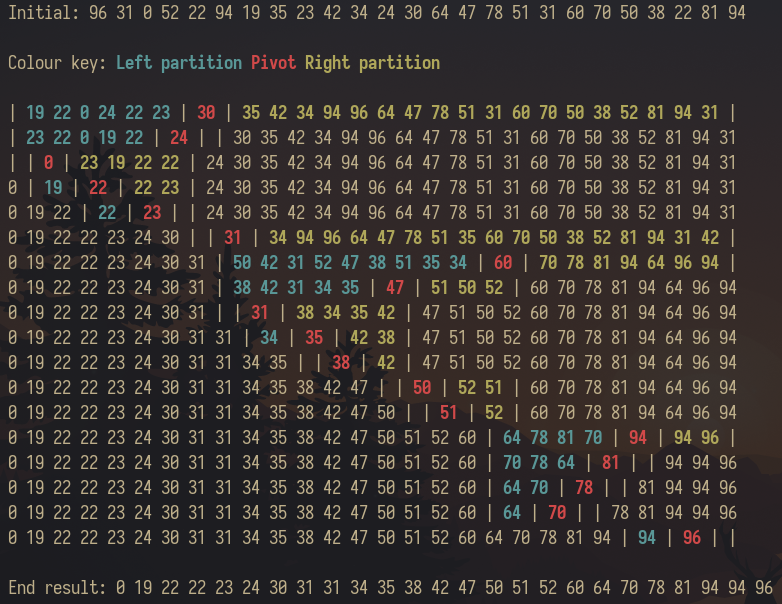

#############
Quicksort (C)
#############

Naive implementation of quicksort with pretty colorful printing to
remind myself that C is a language and that I can program in something
that isn't Scala or Haskell.

Usage
=====

::

	gcc quicksort.c -o quicksort && ./quicksort

